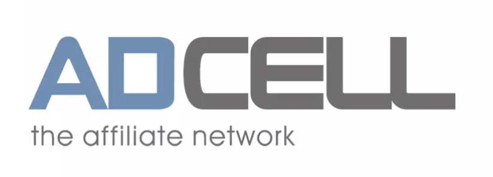

<div id="top"></div>
<!--
*** README template provided by https://github.com/othneildrew/Best-README-Template
-->


<!-- PROJECT SHIELDS -->
<!--
*** I'm using markdown "reference style" links for readability.
*** Reference links are enclosed in brackets [ ] instead of parentheses ( ).
*** See the bottom of this document for the declaration of the reference variables
*** for contributors-url, forks-url, etc. This is an optional, concise syntax you may use.
*** https://www.markdownguide.org/basic-syntax/#reference-style-links
-->
[![Build][build-shield]][build-url]
[![Contributors][contributors-shield]][contributors-url]
[![Forks][forks-shield]][forks-url]
[![Stargazers][stars-shield]][stars-url]
[![Issues][issues-shield]][issues-url]
[![MIT License][license-shield]][license-url]
[![LinkedIn][linkedin-shield]][linkedin-url]


<!-- PROJECT LOGO -->
<br />
<div align="center">
  <a href="https://github.com/othneildrew/Best-README-Template">
    
  </a>

<h3 align="center">adcell-go</h3>

  <p align="center">
    Simple, yet powerful Adcell go client to import data feeds into you projects.
    <br />
    <a href="https://pkg.go.dev/github.com/matthiasbruns/adcell-go"><strong>Explore the docs »</strong></a>
    <br />
    <br />
    <a href="https://pkg.go.dev/github.com/matthiasbruns/adcell-go">View Demo</a>
    ·
    <a href="https://github.com/matthiasbruns/adcell-go/issues">Report Bug</a>
    ·
    <a href="https://github.com/matthiasbruns/adcell-go/issues">Request Feature</a>
  </p>
</div>


<!-- TABLE OF CONTENTS -->
<details>
  <summary>Table of Contents</summary>
  <ol>
    <li>
      <a href="#getting-started">Getting Started</a>
      <ul>
        <li><a href="#prerequisites">Prerequisites</a></li>
        <li><a href="#installation">Installation</a></li>
      </ul>
    </li>
    <li><a href="#contributing">Contributing</a></li>
    <li><a href="#license">License</a></li>
    <li><a href="#contact">Contact</a></li>
    <li><a href="#acknowledgments">Acknowledgments</a></li>
  </ol>
</details>


<!-- ABOUT THE PROJECT -->

## About The Project

Golang Adcell client for https://www.adcell.de

Check the `example` folder to get started.

<p align="right">(<a href="#top">back to top</a>)</p>


<!-- GETTING STARTED -->

## Getting Started

### Prerequisites

You need to have an Adcell account, a promoId and a slotId.

[![Adcell Create A Feed][adcell-create-feed-screenshot]](https://ui.adcell.com)

### Installation

adcell-go supports 2 last Go versions and requires a Go version with
[modules](https://github.com/golang/go/wiki/Modules) support. So make sure to initialize a Go module:

```shell
go mod init github.com/my/repo
```

And then install adcell-go:

```shell
go get github.com/matthiasbruns/adcell-go
```

### Quickstart

```go
package main

import (
	"fmt"
	"github.com/matthiasbruns/adcell-go/adcell"
	"net/http"
)

func main() {
	adcellClient := adcell.NewAdcellClient(&http.Client{})

	fetchDataFeed(adcellClient)
}

func fetchDataFeed(adcellClient *adcell.AdcellClient) {
	feed, err := adcellClient.FetchDataFeed(&adcell.DataFeedOptions{
		PromoId: "promoId",
		SlotId:  "slotId",
	})

	if err != nil {
		panic(err)
	}

	fmt.Println(feed)
}
```

<!-- CONTRIBUTING -->

## Contributing

Contributions are what make the open source community such an amazing place to learn, inspire, and create. Any
contributions you make are **greatly appreciated**.

If you have a suggestion that would make this better, please fork the repo and create a pull request. You can also
simply open an issue with the tag "enhancement". Don't forget to give the project a star! Thanks again!

1. Fork the Project
2. Create your Feature Branch (`git checkout -b feature/AmazingFeature`)
3. Commit your Changes (`git commit -m 'Add some AmazingFeature'`)
4. Push to the Branch (`git push origin feature/AmazingFeature`)
5. Open a Pull Request

<p align="right">(<a href="#top">back to top</a>)</p>


<!-- LICENSE -->

## License

Distributed under the MIT License. See `LICENSE.txt` for more information.

<p align="right">(<a href="#top">back to top</a>)</p>


<!-- CONTACT -->

## Contact

Matthias Bruns - [@MTrax](https://twitter.com/MTrax) - git@matthiasbruns.com - [Discord](https://discord.gg/cYAYAvx6Yj)

Project Link: [https://github.com/matthiasbruns/adcell-go](https://github.com/matthiasbruns/adcell-go)

<p align="right">(<a href="#top">back to top</a>)</p>


<!-- ACKNOWLEDGMENTS -->

## Acknowledgments

Use this space to list resources you find helpful and would like to give credit to. I've included a few of my favorites
to kick things off!

* [Best-README-Template](https://github.com/othneildrew/Best-README-Template)
* [Choose an Open Source License](https://choosealicense.com)

<p align="right">(<a href="#top">back to top</a>)</p>


<!-- MARKDOWN LINKS & IMAGES -->
<!-- https://www.markdownguide.org/basic-syntax/#reference-style-links -->

[build-shield]: https://img.shields.io/github/workflow/status/matthiasbruns/adcell-go/Go/main?style=for-the-badge

[build-url]: https://github.com/matthiasbruns/adcell-go/actions/workflows/go.yml

[contributors-shield]: https://img.shields.io/github/contributors/matthiasbruns/adcell-go.svg?style=for-the-badge

[contributors-url]: https://github.com/matthiasbruns/adcell-go/graphs/contributors

[forks-shield]: https://img.shields.io/github/forks/matthiasbruns/adcell-go.svg?style=for-the-badge

[forks-url]: https://github.com/matthiasbruns/adcell-go/network/members

[stars-shield]: https://img.shields.io/github/stars/matthiasbruns/adcell-go.svg?style=for-the-badge

[stars-url]: https://github.com/matthiasbruns/adcell-go/stargazers

[issues-shield]: https://img.shields.io/github/issues/matthiasbruns/adcell-go.svg?style=for-the-badge

[issues-url]: https://github.com/matthiasbruns/adcell-go/issues

[license-shield]: https://img.shields.io/github/license/matthiasbruns/adcell-go.svg?style=for-the-badge

[license-url]: https://github.com/matthiasbruns/adcell-go/blob/main/LICENSE.txt

[linkedin-shield]: https://img.shields.io/badge/-LinkedIn-black.svg?style=for-the-badge&logo=linkedin&colorB=555

[linkedin-url]: https://linkedin.com/in/matthiasbruns

[adcell-create-feed-screenshot]: docs/images/adcell_promoid_slotid.png